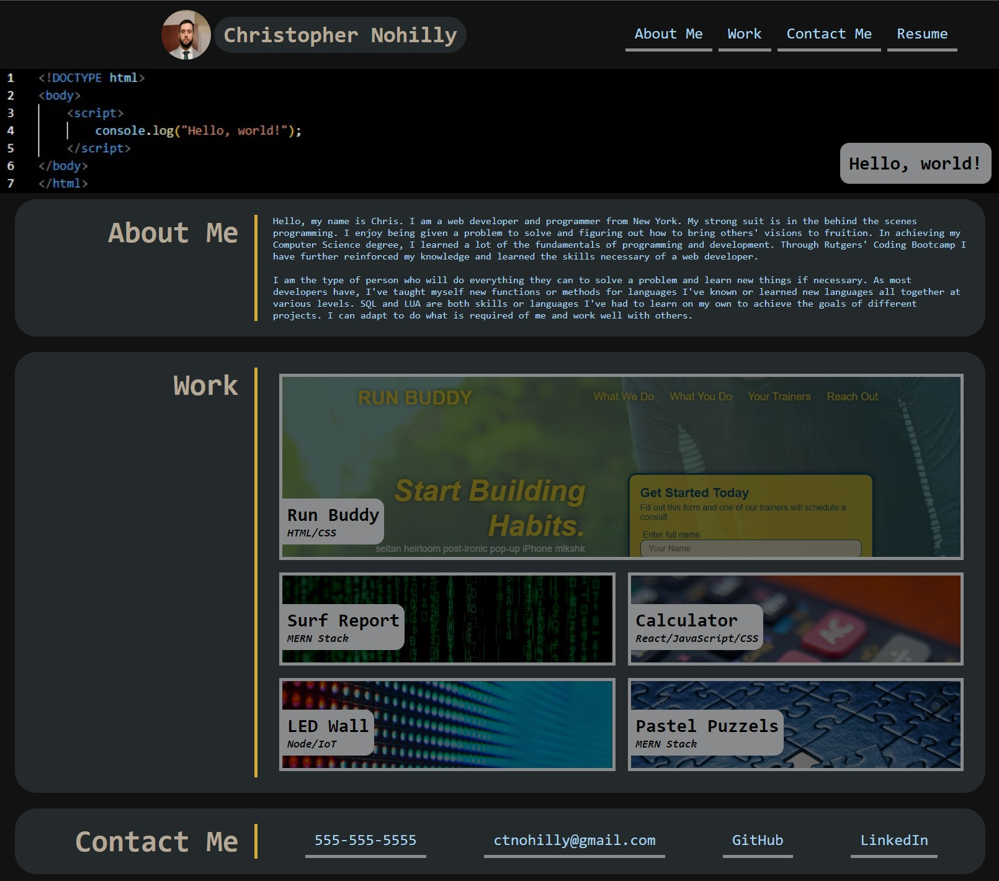

# 02 Advanced CSS: Portfolio

## Description

In this project, I was tasked with creating a portfolio page with a set of acceptance criteria and an example of the general look and functionality to follow. This was built from scratch with only a gif showing the example site. This was made using HTML and CSS only. The primary challenge of this assignment was solving how to achieve the desired functionality and in which way to do so. We were meant to use Flexbox as one of our primary methods of designing this page and many of the elements to be included should be responsive and flexible to fit a variety of screen sizes.

## User Story

```
AS AN employer
I WANT to view a potential employee's deployed portfolio of work samples
SO THAT I can review samples of their work and assess whether they're a good candidate for an open position
```

## Acceptance Criteria

```
GIVEN I need to sample a potential employee's previous work
WHEN I load their portfolio
THEN I am presented with the developer's name, a recent photo or avatar, and links to sections about them, their work, and how to contact them
WHEN I click one of the links in the navigation
THEN the UI scrolls to the corresponding section
WHEN I click on the link to the section about their work
THEN the UI scrolls to a section with titled images of the developer's applications
WHEN I am presented with the developer's first application
THEN that application's image should be larger in size than the others
WHEN I click on the images of the applications
THEN I am taken to that deployed application
WHEN I resize the page or view the site on various screens and devices
THEN I am presented with a responsive layout that adapts to my viewport
```

The following animation is the example showing the web application's desired appearance and functionality:


## Product

This is a link to the deployed webpage: [Christopher Nohilly - Porfolio](https://cnohilly.github.io/cnohilly-portfolio/)

The following image is a screenshot of the deployed application: 


